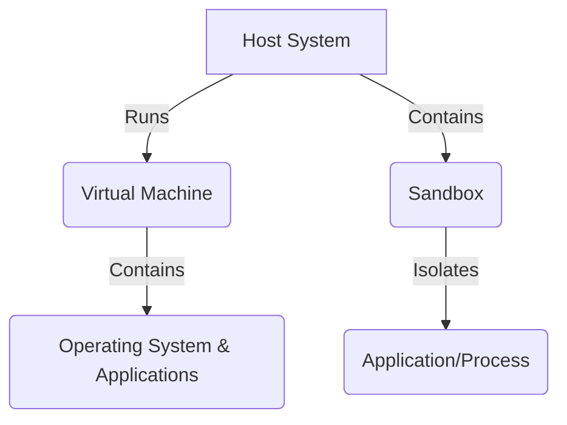
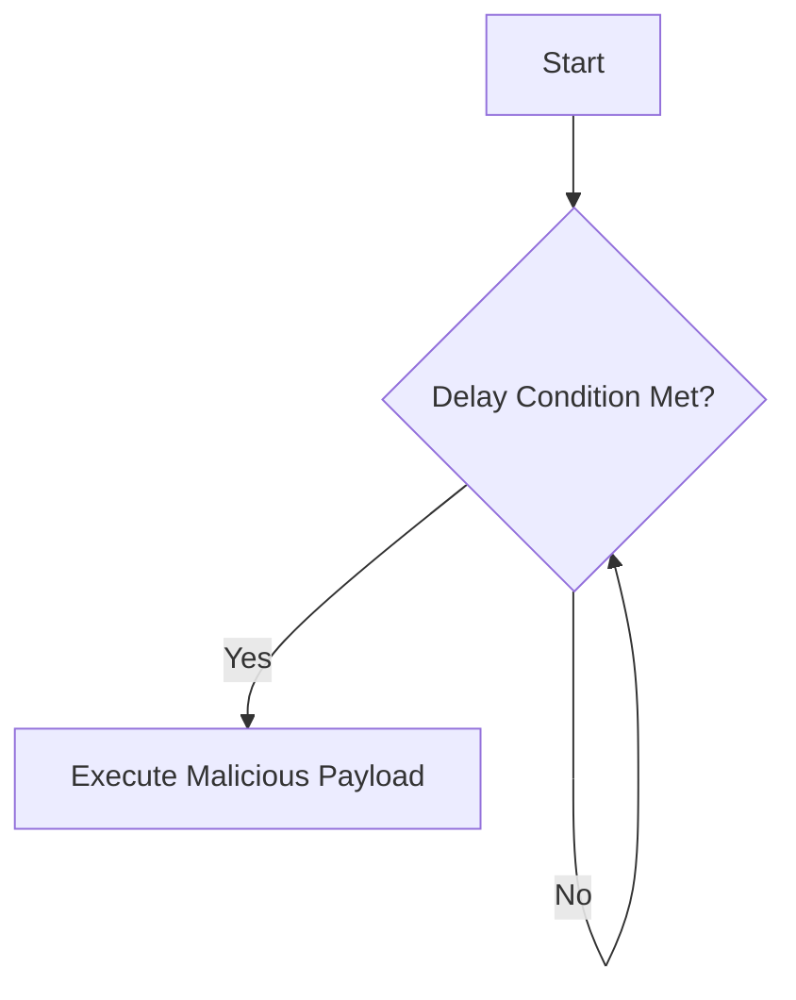

<!--more-->

# How Advanced Malware Evades Sandboxes and Virtual Machines

##  Introduction

In today's rapidly evolving cybersecurity landscape, defenders and attackers are locked in a continuous battle. Security researchers rely on tools such as **sandboxes** and **virtual machines (VMs)** to analyze malware safely. These isolated environments act as controlled laboratories where potentially harmful code can be examined without jeopardizing primary systems. However, malware authors have grown increasingly sophisticated, developing advanced techniques to detect these environments and alter their behavior accordingly.


**Tip:** Understanding these evasion methods is crucial—not only to thwart malware but also to improve your own security analysis techniques.


A deep understanding of these evasion methods is crucial for cybersecurity professionals. By grasping how malware circumvents analysis environments, we can design stronger defenses and build resilient security infrastructures.

##  Sandboxes and Virtual Machines: An Overview

Before diving into evasion tactics, it is essential to understand the role and differences of sandboxes and virtual machines in cybersecurity.

### Virtual Machines (VMs)

A virtual machine is essentially a software-based computer running inside your primary system. Utilizing **virtualization** technology, a single physical host can run multiple isolated guest machines, each with its own operating system and applications. Popular virtualization platforms include VMware, VirtualBox, and Hyper-V.

**Key Uses in Cybersecurity:**

- **Malware Analysis:** VMs provide a safe environment to run and study malware, ensuring that any harmful behavior is contained.
- **Vulnerability Testing:** They allow security experts to safely test software for vulnerabilities without risking the host system.
- **Security Research:** Researchers can simulate entire networks and operating systems for in-depth analysis.

### Sandboxes

A sandbox is a more focused type of isolation, typically used to run and monitor individual applications or processes. Rather than simulating an entire computer, a sandbox restricts a program’s access to critical system resources such as files, memory, and network interfaces.

**Types of Sandboxes:**

- **Full-System Emulation:** Tools like QEMU emulate the entire hardware stack, offering robust isolation but at a higher resource cost.
- **API-Level Sandboxes:** These monitor system calls and intercept or modify them to prevent malicious actions. Cuckoo Sandbox is a well-known example.

**Advantages in Cybersecurity:**

- **Dynamic Analysis:** By observing real-time behavior, sandboxes enable researchers to understand malware operations and develop countermeasures.
- **Automated Threat Evaluation:** They can quickly analyze multiple files to identify and categorize potential threats.



*Diagram 1: Relationship Between Host, VM, and Sandbox*

##  Why Malware Authors Target These Environments

Malware is designed to be stealthy. Recognizing that sandboxes and VMs are common tools for analysis, modern malware employs techniques to detect these environments. Upon detection, malware might:

- **Alter Behavior:** Suppress malicious activity or mimic benign behavior.
- **Remain Dormant:** Delay execution until it is confident that it is operating on a physical machine.
- **Terminate Execution:** Shut down entirely to thwart analysis.


**Important:** This knowledge is for defensive and research purposes only. Always ensure that your testing environment is safe and isolated.


Understanding these tactics helps security professionals improve detection methods and strengthen incident response strategies.

##  Techniques for Detecting Virtualized Environments

Advanced malware employs several methods to discern whether it is running in a virtual or sandboxed environment.

### 1. Inspecting System Artifacts

Malware can examine system artifacts for indicators of virtualization:

- **Registry Keys and Files (Windows):**  
  Virtualization software often leaves identifiable traces. For example, VMware’s `vmci.sys` in the `C:\Windows\System32\drivers\` directory is a common telltale.

    
      
```python
import os

def is_vmware():
    """
    Checks if the system is running within a VMware virtual machine
    by looking for specific driver files.
    """
    try:
        if os.path.exists("C:\\Windows\\System32\\drivers\\vmci.sys"):
            print("VMware detected!")
            return True
    except Exception as e:
        print(f"Error checking for VMware driver: {e}")
    return False

if is_vmware():
    exit()
```
      
      
```powershell
function Test-IsVmware {
  # Determines if the system is running inside a VMware virtual machine
  # by verifying the existence of a specific driver file.

  if (Test-Path -Path "C:\Windows\System32\drivers\vmci.sys") {
    Write-Host "VMware detected!"
    return $true
  }
  return $false
}

if (Test-IsVmware) {
  exit
}
```
      
    

- **MAC Addresses and Device Names:**  
  Virtual network adapters often have distinctive MAC address prefixes (e.g., `00:50:56` for VMware, `08:00:27` for VirtualBox) or names that hint at virtualization.
  
- **CPU Vendor, BIOS, and Hard Drive Identifiers:**  
  Virtual environments might report anomalous values (e.g., `KVMKVMKVM` or “Microsoft Hv”) and use non-standard BIOS or serial number formats.

- **Resource Configuration:**  
  Limited RAM or CPU cores (e.g., less than 2GB of RAM or a single processor) can indicate a virtualized setup.

- **Guest Additions:**  
  The presence of virtualization-specific tools (e.g., VMware Tools or VirtualBox Guest Additions) is a strong indicator.

### 2. Timing-Based Analysis

Timing differences between virtualized and physical environments can be exploited:

- **CPU Instruction Timing:**  
  Malware might use the `RDTSC` (Read Time-Stamp Counter) instruction to measure execution speed. Discrepancies can indicate virtualization overhead.

- **API Call Latency:**  
  The execution time of certain system calls may reveal delays typical of virtual environments.

- **Network Latency:**  
  Consistently uniform network response times can also signal sandbox simulations.

##  Methods for Sandbox Detection

Beyond virtualization, malware also searches for characteristics unique to sandbox environments.

### 1. Monitoring Running Processes

Sandboxes typically run dedicated monitoring software. Malware can inspect the process list for names associated with analysis tools:

```python
import psutil

def is_sandbox():
    """
    Determines if the system is running within a sandbox
    by scanning for known sandbox process names.
    """
    sandbox_processes = ["cuckoo", "joebox", "anubis", "threatanalyzer", "vmsandbox", "detonate"]
    try:
        for process in psutil.process_iter(attrs=['name']):
            process_name = process.info['name'].lower()
            if any(sandbox in process_name for sandbox in sandbox_processes):
                print("Sandbox detected!")
                return True
    except (psutil.NoSuchProcess, psutil.AccessDenied, psutil.ZombieProcess) as e:
        print(f"Process scan error: {e}")
    return False

if is_sandbox():
    exit()
```

### 2. Detecting Lack of User Interaction

Automated sandboxes often lack genuine user input. Malware might check for:

- **Mouse and Keyboard Activity:**  
  Minimal movement or keystrokes may be indicative.
  
- **Window Activity:**  
  A static or single-window desktop environment can be suspicious.

### 3. Evaluating System Uptime

A very short system uptime is a common characteristic of sandbox environments:

```python
import psutil
import time

def is_short_uptime():
    """
    Checks if the system uptime is suspiciously short, which may indicate
    that the system is a sandbox created for short-term analysis.
    """
    try:
        boot_time = psutil.boot_time()
        uptime_seconds = time.time() - boot_time
        if uptime_seconds < 300:  # Less than 5 minutes
            print("Likely running in a sandbox!")
            return True
    except Exception as e:
        print(f"Error checking uptime: {e}")
    return False

if is_short_uptime():
    exit()
```

### 4. Environmental and Connectivity Checks

- **Internet Access:**  
  Restricted or simulated connectivity can indicate sandbox constraints.
  
- **Screen Resolution and CPU Core Count:**  
  Non-standard display settings or a low core count can hint at a sandboxed setup.

##  Advanced Malware Evasion Techniques

Modern malware leverages a variety of advanced tactics to avoid detection:

### 1. Self-Encryption and Packing

- **Encryption:**  
  Malware may encrypt its payload, only decrypting it in memory during execution.
- **Packing:**  
  Using packers (e.g., UPX, Themida, VMProtect) to obfuscate and compress code complicates static analysis.

### 2. Debugger Detection

To hinder reverse engineering, malware includes checks for active debuggers:

```python
import ctypes

def is_debugger_present():
    """
    Utilizes the Windows API to detect if a debugger is attached.
    """
    try:
        kernel32 = ctypes.windll.kernel32
        if kernel32.IsDebuggerPresent():
            print("Debugger detected!")
            return True
    except Exception as e:
        print(f"Debugger check error: {e}")
    return False

if is_debugger_present():
    exit()
```

Additional methods include the use of **CheckRemoteDebuggerPresent**, inspecting debug registers, and timing-based checks that reveal debugger-induced delays.

### 3. Delayed Execution and Sleep Tactics

Malware may postpone its malicious behavior to bypass time-limited sandbox analysis:

- **Timer-Based Delays:**  
  Scheduling execution after a delay can help evade detection.
- **Sleep Calls & Junk Code:**  
  Instead of a single long sleep (e.g., `time.sleep(300)`), malware might insert redundant computations to stall analysis without alerting sandbox acceleration.

```python
import time

def sleep_delay():
    """Delays payload execution for 5 minutes."""
    print("Delaying execution for 5 minutes...")
    time.sleep(300)
    print("Executing payload...")

sleep_delay()
```



*Diagram 2: Flow of Delayed Execution*

### 4. Code Obfuscation

Techniques to obfuscate code include:

- **Dead Code Insertion:**  
  Adding redundant or unreachable code to confuse analysts.
- **Control Flow Flattening:**  
  Restructuring code to make reverse engineering difficult.
- **String Encryption and Instruction Substitution:**  
  Concealing strings and replacing simple instructions with complex alternatives.

### 5. API Hammering and Process Injection

- **API Hammering:**  
  Bombarding the system with rapid API calls may overwhelm sandbox monitors.
- **Process Injection:**  
  Injecting code into trusted processes (via methods like `VirtualAllocEx` and `CreateRemoteThread`) allows malware to hide its malicious activity.



### Process Injection Steps

{}
1. **Target Selection:**  
   Identify a suitable process for injection.
2. **Open Target Process:**  
   Acquire a handle using functions like `OpenProcess`.
3. **Memory Allocation:**  
   Reserve memory in the target process using `VirtualAllocEx`.
4. **Code Injection:**  
   Write the malicious payload into the allocated memory with `WriteProcessMemory`.
5. **Code Execution:**  
   Execute the injected code by creating a remote thread via `CreateRemoteThread`.
{}



##  Key Issues to Consider

To summarize, here are some **visual issues** and potential pitfalls when analyzing or developing countermeasures against advanced malware:


- **False Positives:**  
  Legitimate software or benign virtual environments might mimic some artifacts of virtualization.
- **Evasion Adaptability:**  
  Malware authors continuously update their techniques, making static signatures less effective.
- **Resource Limitations:**  
  Sandboxes with restricted resources might be more easily detected.
- **Timing Attacks:**  
  Over-reliance on timing-based detection can lead to misinterpretation of normal delays.


##  Conclusion

Malware evasion techniques continue to evolve, posing ongoing challenges for cybersecurity professionals. By understanding how malware detects and circumvents sandboxes and virtual machines, we can develop more effective countermeasures and build robust security systems.

Staying informed and adaptive is paramount in the fight against increasingly sophisticated threats. The techniques discussed in this guide underscore the importance of continuous research and innovation in cybersecurity.

For an in-depth look, check out our [video tutorial](https://www.youtube.com/watch?v=dQw4w9WgXcQ) on advanced malware evasion techniques.


**Disclaimer:** The code samples and techniques presented in this post are for educational and research purposes only. They demonstrate methods used by malware for evasion and should not be employed for any malicious activities.

