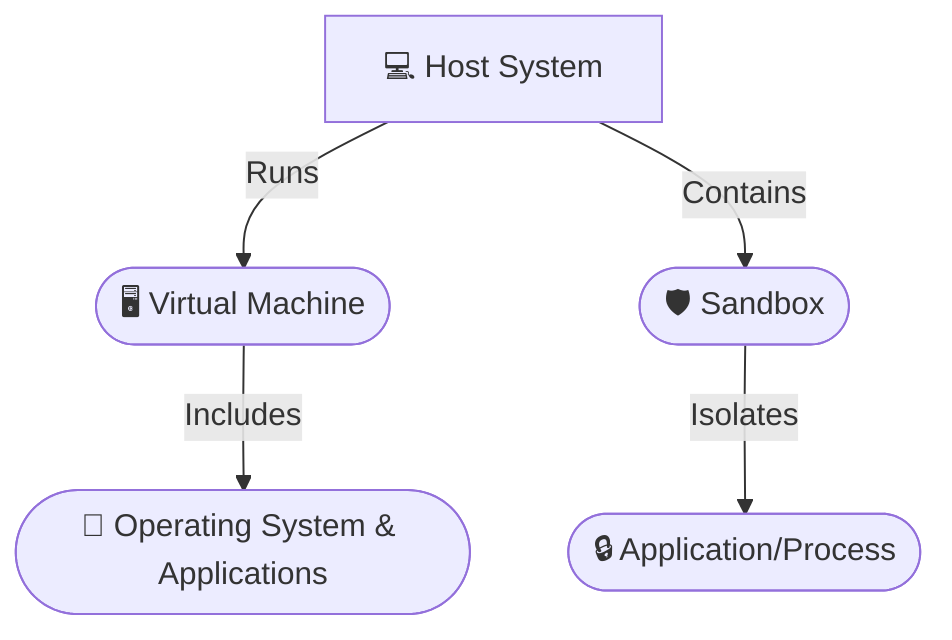

<!--more-->


##  Introduction

In the constantly evolving world of cybersecurity, both attackers and defenders must continuously adapt their strategies. Malware authors design their code to operate stealthily, often implementing multiple layers of evasion to avoid detection by security analysts. One key aspect of these evasion strategies is detecting and bypassing **sandboxes** and **virtual machines (VMs)**—the controlled environments that researchers use to safely analyze potentially harmful software.

This comprehensive guide explores:
- **How malware detects virtualized environments and sandboxes.**
- **Advanced methods malware employs to evade analysis.**
- **Best practices for analyzing malware safely.**

Understanding these advanced techniques is crucial for building robust defenses, improving incident response, and staying one step ahead of emerging threats.


**Pro Insight:** An in-depth understanding of malware evasion not only aids in forensic investigations but also enhances your ability to design hardened systems and detection frameworks.


---

##  Understanding Sandboxes and Virtual Machines

Before diving into evasion techniques, it is essential to understand the core environments used for malware analysis.

### Virtual Machines (VMs)

A virtual machine is a software emulation of a physical computer. Virtualization technology allows one physical host to run several isolated guest systems, each operating as an independent computer. Common platforms include VMware, VirtualBox, and Hyper-V.

**Primary Uses:**
- **Malware Analysis:** Run malware in isolation without risking production systems.
- **Vulnerability Testing:** Assess system or software vulnerabilities in a controlled environment.
- **Network Simulation:** Emulate complex network environments for research.

### Sandboxes

A sandbox is a restricted execution environment designed to run and monitor individual applications or processes. Unlike VMs, sandboxes typically do not simulate an entire operating system but focus on isolating the execution of a particular program.

**Types of Sandboxes:**
- **Full-System Emulation:** (e.g., QEMU) Emulates the entire hardware and OS environment.
- **API-Level Sandboxes:** (e.g., Cuckoo Sandbox) Intercepts system calls to monitor behavior.

**Advantages:**
- **Dynamic Analysis:** Real-time observation of program behavior.
- **Automated Testing:** Quickly assess large volumes of files for malicious activity.



*Diagram 1: Architecture of a Host System with a Virtual Machine and a Sandbox*

---

##  Why Malware Authors Target These Environments

Since sandboxes and VMs are the primary tools for malware analysis, attackers design their code to detect these environments. When a virtualized or sandboxed environment is detected, malware might:

- **Alter Behavior:** Modify execution to mimic benign software.
- **Delay Activation:** Remain dormant until it is confident it is running on a real system.
- **Self-Terminate:** Shut down entirely to avoid being analyzed.


**Security Alert:** Always conduct malware analysis in secure, isolated environments. The techniques discussed in this guide are intended solely for defensive and research purposes.


---

##  Techniques for Detecting Virtualized Environments

Malware employs various techniques to determine if it is operating in a VM. Below, we detail several detection methods.

### Step-by-Step Virtualization Detection

{}
1. **Inspect System Artifacts:**  
   - **Registry Keys & Files:** Virtualization software typically leaves traces. For example, VMware installs `vmci.sys` in `C:\Windows\System32\drivers\`.
   - **Device Names & MAC Addresses:** Virtual network adapters often have known MAC address prefixes (e.g., `00:50:56` for VMware).
2. **Timing-Based Analysis:**  
   - **CPU Instructions:** Using instructions like `RDTSC` to measure execution time and detect virtualization overhead.
   - **API Call Latency:** Inconsistencies in execution time can be an indicator.
3. **Hardware Checks:**  
   - **CPU Vendor & BIOS Information:** Unusual values like `KVMKVMKVM` or “Microsoft Hv” may be reported.
   - **Resource Configuration:** Limited resources (e.g., low RAM or single-core CPUs) can suggest a VM.
4. **Guest Additions Detection:**  
   - Tools such as VMware Tools or VirtualBox Guest Additions are common in virtualized systems.
{}

### Example: Detecting VMware Using Tabs (Python & PowerShell)


  
```python
import os

def is_vmware():
    """
    Check if the system is running within a VMware virtual machine
    by detecting a known VMware driver file.
    """
    try:
        if os.path.exists("C:\\Windows\\System32\\drivers\\vmci.sys"):
            print("VMware detected!")
            return True
    except Exception as e:
        print(f"Error checking for VMware driver: {e}")
    return False

if is_vmware():
    exit()
```
  
  
```powershell
function Test-IsVmware {
  # Check for the presence of VMware's vmci.sys driver file.
  if (Test-Path -Path "C:\Windows\System32\drivers\vmci.sys") {
    Write-Host "VMware detected!" -ForegroundColor Cyan
    return $true
  }
  return $false
}

if (Test-IsVmware) { exit }
```
  


---

##  Techniques for Sandbox Detection

In addition to VM detection, malware often uses methods to determine if it is running in a sandbox.

### Step-by-Step Sandbox Detection

{}
1. **Process Scanning:**  
   - Identify processes related to sandbox software (e.g., "cuckoo", "anubis", "joebox").
2. **User Interaction Analysis:**  
   - Lack of mouse movement, keyboard input, or window activity can indicate an automated environment.
3. **System Uptime Check:**  
   - A very short system uptime (e.g., under 5 minutes) often signifies a sandbox created solely for analysis.
4. **Environmental Verification:**  
   - Check for anomalies in network connectivity and display configuration.
{}

### Example: Checking for Short System Uptime

```python
import psutil
import time

def is_short_uptime():
    """
    Determines if the system uptime is suspiciously short, which may suggest a sandbox environment.
    """
    try:
        boot_time = psutil.boot_time()
        uptime = time.time() - boot_time
        if uptime < 300:  # Uptime under 5 minutes
            print("Sandbox environment detected!")
            return True
    except Exception as e:
        print(f"Uptime check error: {e}")
    return False

if is_short_uptime():
    exit()
```

---

##  Advanced Malware Evasion Techniques

Modern malware implements multiple layers of evasion. Beyond detecting VMs and sandboxes, advanced malware can:

- **Self-Encrypt and Pack:**  
  - Encrypt its payload and decrypt it only in memory.  
  - Use packers like UPX, Themida, or VMProtect to compress and obfuscate code.
- **Detect Debuggers:**  
  - Call Windows API functions (e.g., `IsDebuggerPresent()`) to check for debugging.
- **Delay Execution:**  
  - Use sleep functions or complex code loops to postpone execution.
- **Obfuscate Code:**  
  - Insert dead code, flatten control flow, or substitute instructions to confuse static analysis.
- **API Hammering and Process Injection:**  
  - Flood system calls to overwhelm monitoring tools.
  - Inject malicious code into legitimate processes to hide execution.

### Step-by-Step Advanced Evasion Techniques

{}
1. **Self-Encryption and Packing:**  
   - Encrypt code so it appears as gibberish until runtime decryption occurs.
2. **Debugger Detection:**  
   - Use both standard API calls and timing discrepancies to determine if a debugger is present.
3. **Delayed Execution:**  
   - Implement timers or conditional loops to delay malicious behavior until after analysis.
4. **Code Obfuscation:**  
   - Insert redundant code and reformat control flows to impede reverse engineering.
5. **API Hammering & Process Injection:**  
   - Rapidly call system APIs to obscure behavior.
   - Inject code into trusted processes using methods like `VirtualAllocEx`, `WriteProcessMemory`, and `CreateRemoteThread`.
{}

### Example: Debugger Detection in Python

```python
import ctypes

def is_debugger_present():
    """
    Uses Windows API to check if a debugger is attached to the process.
    """
    try:
        kernel32 = ctypes.windll.kernel32
        if kernel32.IsDebuggerPresent():
            print("Debugger detected!")
            return True
    except Exception as e:
        print(f"Debugger check error: {e}")
    return False

if is_debugger_present():
    exit()
```

### Example: Delayed Execution with Sleep and Detailed Flowchart

```python
import time

def sleep_delay():
    """Delays execution for 5 minutes before launching the payload."""
    print("⏳ Delaying execution for 5 minutes...")
    time.sleep(300)
    print("🚀 Executing payload...")

sleep_delay()
```


*Diagram 2: Detailed Flow of Delayed Execution*

---

##  Best Practices & Additional Context

When analyzing malware or designing countermeasures, adhere to these best practices:


- **Isolation:** Always conduct analysis in dedicated, secure environments.
- **Regular Updates:** Keep analysis tools, sandbox configurations, and virtual machines current.
- **Layered Analysis:** Combine static, dynamic, and behavioral methods to improve detection.
- **Continuous Education:** Stay informed about emerging evasion techniques and update your methodologies.
- **Documentation:** Maintain thorough documentation of observed evasion tactics for future reference.


**Additional Methods Worth Considering:**
- **Memory Scanning:**  
  Analyze the memory footprint of processes to detect injected or hidden code.
- **CPU Fingerprinting:**  
  Compare CPU performance metrics against known physical hardware baselines.
- **Network Anomaly Detection:**  
  Monitor network traffic for unusual patterns that may indicate sandbox simulation or API hammering.
- **Hybrid Analysis:**  
  Use a combination of sandboxing and VM-based analysis to correlate findings and reduce false positives.
  
---

## Conclusion

Malware evasion techniques are continually advancing, creating a challenging landscape for cybersecurity professionals. By understanding how malware detects and bypasses sandboxes and virtual machines, you can develop stronger, more resilient defenses.

Adopting a layered analysis approach, staying current with the latest research, and rigorously testing your environments are crucial steps in countering these threats. For further insights and practical demonstrations, explore our [in-depth video tutorial](https://www.youtube.com/watch?v=dQw4w9WgXcQ) on advanced malware evasion techniques.


**Disclaimer:** The techniques and code samples in this post are provided for educational and research purposes only. They demonstrate methods used by malware for evasion and should never be applied for any malicious activities.

