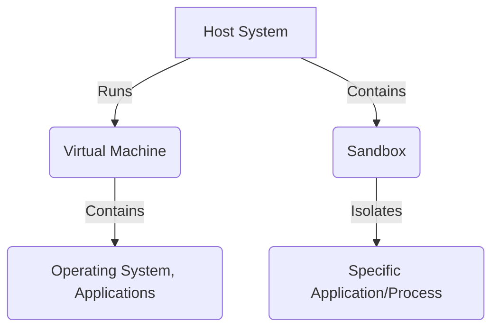
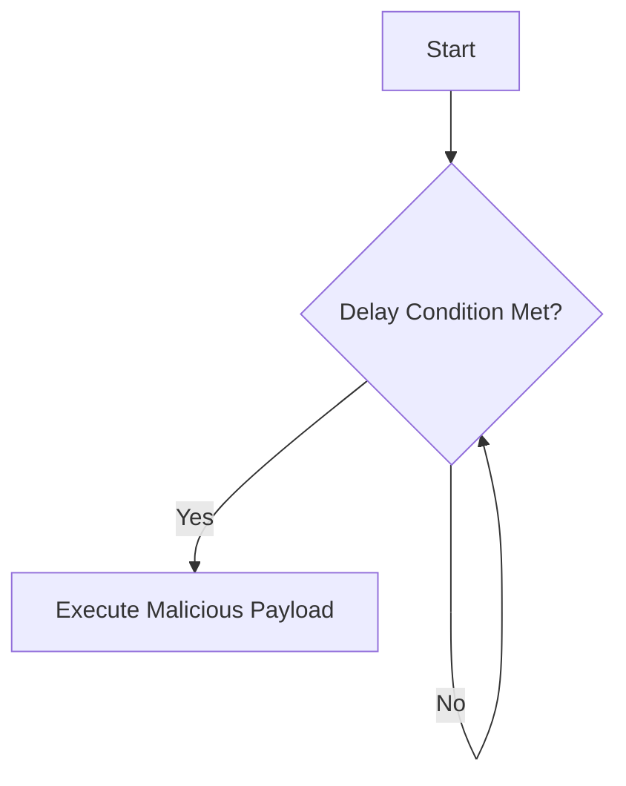

<!--more-->


# How Advanced Malware Evades Sandboxes and Virtual Machines

##  Introduction

In the world of cybersecurity, there's a continuous back-and-forth between those working to secure systems and those trying to break into them. Security researchers often use tools like **sandboxes** and **virtual machines (VMs)** to analyze malicious software (malware). You can think of these tools as secure, isolated labs where potentially harmful code can be studied without risking the main computer system. However, malware authors have become increasingly clever, developing ways for their code to detect these virtual environments and change their behavior to avoid being caught.

Understanding how malware evades detection is important for everyone in cybersecurity, from beginners to experienced professionals. By knowing these techniques, we can build better defenses and protect our digital world from these increasingly sophisticated threats. This knowledge helps us create stronger security systems and defend against these clever attacks.

##  What Are Sandboxes and Virtual Machines?

Let's start by understanding what sandboxes and virtual machines are and why they're used in cybersecurity.

### Virtual Machines (VMs)

Imagine having multiple computers inside your main computer. That's what a virtual machine lets you do. A VM is like a computer simulated by software, complete with its own operating system, storage, and applications. This is possible because of **virtualization**, a technology that allows one physical computer (the "host") to run several separate virtual machines (the "guests"). Some popular virtualization software includes VMware, VirtualBox, and Hyper-V.

**Why are VMs used in cybersecurity?**

*   **Malware Analysis:** VMs offer a safe space to run and study malware. If the malware does its worst, it only affects the VM, not your main system.
*   **Vulnerability Testing:** Security experts use VMs to test for weaknesses in software without risking their primary computers.
*   **Security Research:** VMs allow researchers to create controlled environments for studying operating systems, networks, and security.

### Sandboxes

A sandbox is a more specialized type of isolated environment. While a VM simulates an entire computer, a sandbox usually focuses on isolating a specific program or process. Think of it as a "secure container" within your operating system. The sandbox limits the program's access to system resources, like files, memory, and network connections, preventing it from harming the main system.

**Types of Sandboxes:**

*   **Full-System Emulation:** These sandboxes simulate an entire computer system, including hardware and the operating system. QEMU is an example. They offer strong isolation but can use a lot of resources.
*   **API-Level Sandboxes:** These are lighter and work by watching and controlling the system calls a program makes. They filter or change these calls to prevent harmful actions. Cuckoo Sandbox is a common example used for analyzing malware.

**Why are sandboxes used in cybersecurity?**

*   **Dynamic Malware Analysis:** Sandboxes let researchers watch malware's behavior in real time. By monitoring the malware's actions, analysts can understand how it works, find its targets, and create defenses.
*   **Automated Threat Analysis:** Sandboxes can be used to automatically analyze many suspicious files, quickly identifying potential threats.



*Diagram 1: Host, VM, and Sandbox Relationship*

###  Why Do Malware Authors Want to Evade These Environments?

Malware creators know that security researchers use sandboxes and VMs to analyze threats. If their malware can detect it's in one of these environments, it can use various tricks to avoid detection:

*   **Changing Behavior:** The malware might act differently in a virtual environment than on a real computer. For example, it might not run its harmful code or connect to its command server.
*   **Staying Dormant:** The malware might just "sleep" or stay inactive for a long time, hoping to outlast the sandbox's analysis period.
*   **Stopping Execution:** The malware might detect the virtual environment and simply shut itself down, preventing any analysis.

By avoiding detection, malware authors can significantly hinder security researchers and increase their malware's chances of infecting real systems.

##  How Malware Detects Virtualized Environments

Advanced malware uses a variety of clever techniques to determine whether it's running inside a virtual machine.

### 1. Checking System Artifacts

Malware can look for clues that reveal the presence of virtualization software.

*   **Registry Keys and Files (Windows):**
    *   The Windows Registry stores settings for the operating system and installed applications. Virtualization software often leaves specific registry keys and values. Certain files and directories are also typically linked to virtualization products.
    *   For example, VMware installs files like `vmci.sys` in the `C:\Windows\System32\drivers\` directory. Malware can check for these files to see if it's in a VMware environment.

    
      

        ```python
        import os

        def is_vmware():
            """
            Checks if the system is running inside a VMware virtual machine
            by looking for a specific driver file.
            """
            try:
                if os.path.exists("C:\\Windows\\System32\\drivers\\vmci.sys"):
                    print("VMware detected!")
                    return True
            except Exception as e:
                print(f"Error checking for VMware driver: {e}")
            return False

        if is_vmware():
            exit()
        ```
      
      

        ```powershell
        function Test-IsVmware {
          # Checks if the system is running inside a VMware virtual machine
          # by looking for a specific driver file.

          if (Test-Path -Path "C:\Windows\System32\drivers\vmci.sys") {
            Write-Host "VMware detected!"
            return $true
          }
          else {
            return $false
          }
        }

        if (Test-IsVmware) {
          exit
        }
        ```
      
    


*   **MAC Addresses and Device Names:**
    *   MAC addresses are unique identifiers for network interfaces. Virtualization vendors have specific ranges of MAC addresses for their VMs. For example, addresses starting with `00:50:56` are often used by VMware, and those starting with `08:00:27` are often used by VirtualBox.
    *   Malware can also look at the names of hardware devices, like network adapters, looking for strings like "VMware" or "VirtualBox."

*   **CPU Vendor and Model:**
    *   Malware can check the CPU vendor and model. Virtual environments might show different CPU information than physical machines. For example, the vendor might be "KVMKVMKVM" or "Microsoft Hv."

*   **BIOS and Firmware:**
    *   VMs often have different BIOS or firmware versions than physical machines. Malware can check this information against known values for virtualization software.

*   **Hard Drive Serial Numbers:**
    *   Virtual hard drives may have serial numbers with specific patterns or vendor strings. Malware can check the hard drive serial number.

*   **Amount of RAM and Number of Processors:**
    *   Sandboxes and VMs used for analysis are often given limited resources. Malware can check the amount of RAM and the number of processors. An unusually low amount (like less than 2GB of RAM or only one processor) might suggest a virtual environment.

*   **Presence of Guest Additions:**
    *   Many virtualization solutions offer "guest additions" that are installed in the VM to improve performance and integration with the host. These tools often create specific files, processes, or registry entries that malware can detect.

### 2. Timing-Based Analysis

Virtualization can make some operations take a bit longer in a VM than on a physical machine. Malware can use these timing differences to detect virtual environments.

*   **Note:** While `RDTSC` was mentioned previously, it's not reliably implementable in pure Python across different environments. Thus, we will not include a code example for it here but will explain the concept.
    *   The `RDTSC` (Read Time-Stamp Counter) instruction is a low-level x86 instruction that returns the CPU's time-stamp counter, which increases with each clock cycle. By measuring how long a piece of code takes to run using `RDTSC`, malware can estimate the CPU's clock speed.
    *   In a virtual environment, the measured speed might be lower than the host CPU's actual speed because of virtualization overhead. Malware can compare the measured speed against expected values for physical machines to detect potential virtualization.

*   **API Call Timing:**
    *   Malware can measure how long specific API calls take and compare the results to expected values on a physical machine. Some API calls, especially those involving input/output or system resources, might take longer in a virtual environment.

*   **Network Latency:**
    *   Sandboxes and VMs used for analysis might have simulated network conditions with unusually low or consistent latency. Malware can measure network latency by sending pings or making network requests and analyzing the response times.

{}
### Check for Virtualization Artifacts

Malware starts by checking for telltale signs of virtualization, such as specific files, registry entries, or hardware characteristics that are commonly associated with virtual machines.

### Perform Timing Analysis

If the initial checks are inconclusive, the malware might proceed to perform timing-based analysis. This involves measuring the execution time of certain operations or instructions and comparing them against expected values for physical machines.

### Analyze Network Behavior
Malware may also check for internet connectivity and also analyze network latency.

### Make a Decision

Based on the results of the checks, the malware makes a decision. If it determines that it's likely running in a virtualized environment, it might alter its behavior, remain dormant, or terminate itself to avoid detection. If not, it will continue on it's normal execution path.
{}

##  How Malware Identifies Sandboxes

Besides detecting VMs, malware often tries to identify sandboxes, which are commonly used for dynamic malware analysis.

### 1. Checking Running Processes

Sandboxes often run special tools to monitor malware behavior. Malware can scan the list of running processes and look for names associated with known sandbox environments.

```python
import psutil

def is_sandbox():
    """
    Checks if the system is potentially running a sandbox
    by looking for known sandbox process names.
    """
    sandbox_processes = ["cuckoo", "joebox", "anubis", "threatanalyzer", "vmsandbox", "detonate"]
    try:
        for process in psutil.process_iter(attrs=['name']):
            process_name_lower = process.info['name'].lower()
            if any(proc in process_name_lower for proc in sandbox_processes):
                print("Sandbox detected!")
                return True
    except (psutil.NoSuchProcess, psutil.AccessDenied, psutil.ZombieProcess) as e:
        print(f"Error accessing process information: {e}")
    return False

if is_sandbox():
    exit()
```

### 2. User Interaction Checks

Sandboxes often run malware automatically without real user interaction. Malware can exploit this by waiting for signs of genuine user activity before doing anything malicious.

*   **Mouse Movement:** Malware can check if the mouse has moved recently. In a sandbox, the mouse might stay still unless the sandbox simulates movement.
*   **Keyboard Input:** Malware can check if any keys have been pressed. In an automated sandbox, there might be no keyboard input.
*   **Active Windows:** Malware can check if any windows have been opened, closed, or resized. In a sandbox, the malware's window might be the only one, and it might stay the same.

### 3. System Uptime Checks

Sandboxes are usually short-lived, created just to analyze a piece of malware. Malware can check how long the system has been running (the uptime) and guess it's in a sandbox if the uptime is very short.

```python
import psutil
import time

def is_short_uptime():
    """
    Checks if the system uptime is potentially too short,
    which could indicate a sandbox environment.
    """
    try:
        boot_time = psutil.boot_time()
        uptime_seconds = time.time() - boot_time
        if uptime_seconds < 300:  # Less than 5 minutes
            print("Likely running in a sandbox!")
            return True
    except Exception as e:
        print(f"Error checking system uptime: {e}")
    return False

if is_short_uptime():
    exit()
```

### 4. Environmental Checks

*   **Internet Connectivity:** Some sandboxes might restrict or simulate internet access. Malware can try to connect to websites or servers to check for connectivity. If the connection fails, it might be in a sandbox.
*   **Screen Resolution:** Sandboxes often use default or low screen resolutions. Malware can check the resolution and compare it to common values on real systems.
*   **Number of CPU Cores:** Sandboxes might allocate a limited number of CPU cores to the VM. Malware can check the number of cores and compare it to typical values for physical machines.

##  Advanced Evasion Techniques

To further avoid detection, malware authors use advanced techniques that make analysis harder.

### 1. Self-Encryption and Packing

*   **Encryption:** Malware can encrypt its code and data to hide its true functionality. It decrypts itself in memory only when run, making it hard to analyze without executing it.
*   **Packing:** Packers are tools that compress and/or encrypt executable files. They add a layer of disguise that makes it harder to reverse-engineer the malware. Popular packers include UPX, Themida, and VMProtect. Packed malware usually has a small "stub" of code that unpacks the original code in memory before running it.

### 2. Debugger Detection

Debuggers are tools used to step through code, inspect variables, and find bugs or malicious behavior. Malware often includes checks to see if it's being debugged.

```python
import ctypes

def is_debugger_present():
    """
    Checks if a debugger is currently attached to the process (Windows).
    """
    try:
        kernel32 = ctypes.windll.kernel32
        if kernel32.IsDebuggerPresent():
            print("Debugger detected!")
            return True
    except Exception as e:
        print(f"Error checking for debugger: {e}")
    return False

if is_debugger_present():
    exit()
```

*   **`IsDebuggerPresent()` API (Windows):** This Windows function returns `TRUE` if the process is being debugged, and `FALSE` otherwise.
*   **`CheckRemoteDebuggerPresent()` API (Windows):** This lets a process check if another process is being debugged.
*   **Debug Registers:** Debuggers often use special CPU registers (like `DR0`-`DR7` on x86) to set breakpoints and control execution. Malware can check these registers to detect a debugger.
*   **Timing-Based Checks:** Debuggers can slow down program execution. Malware can use timing techniques, similar to those for detecting virtualization, to detect a debugger.

### 3. Delayed Execution and Sleep Tricks

*   **Delayed Execution:** Malware can delay running its harmful code to bypass sandboxes that only analyze a program for a short time. It can do this using:
    *   **Timers:** The malware sets a timer to trigger the code after a delay.
    *   **Task Scheduling:** The malware schedules a task to run later.
    *   **Waiting for Specific Events:** The malware waits for an event like a system reboot, a specific date/time, or user interaction.

*   **Sleep Tricks:**
    *   **Long Sleeps:** A simple way to delay execution is to use the `time.sleep()` function to pause the program for a long time. But some sandboxes can detect and speed up sleep calls.

    ```python
    import time

    def sleep_delay():
        """Delays execution for 5 minutes using time.sleep()."""
        print("Waiting for 5 minutes...")
        time.sleep(300)  # Sleep for 5 minutes
        print("Executing payload...")

    sleep_delay()
    ```

    *   **Junk Code:** To avoid relying on `Sleep()`, malware can insert "junk code" or complex calculations to waste time without triggering sandbox acceleration.



*Diagram 3: Delayed Execution in Malware*

### 4. Code Obfuscation

Code obfuscation makes the malware's code harder to understand and analyze. This can involve:

*   **Dead Code Insertion:** Adding code that is never run but makes the program seem more complex.
*   **Control Flow Flattening:** Making the program's control flow hard to follow.
*   **String Encryption:** Encrypting strings to hide their meaning.
*   **Instruction Substitution:** Replacing instructions with more complex sequences that do the same thing.

### 5. API Hammering

API hammering means making many API calls in a short time. This can overwhelm the sandbox's monitoring and potentially make it miss important events.

### 6. Process Injection

Process injection is where malware injects its code into a legitimate process to hide and avoid detection. This makes it look like the harmful actions are coming from a trusted program.



## Process Injection Steps

{}
### Target Selection
The malware selects a target process into which it will inject its malicious code.

### Open Target Process
The malware uses functions like `OpenProcess` (on Windows) to obtain a handle to the target process.

### Allocate Memory
It allocates memory within the target process using functions like `VirtualAllocEx`.

### Write Code
The malware writes its malicious code into the allocated memory space of the target process using `WriteProcessMemory`.

### Execute Code
The malware executes the injected code within the target process, often by creating a new thread with `CreateRemoteThread` or manipulating an existing thread.
{}



  
  
  
  


##  Conclusion

Malware authors use a variety of increasingly sophisticated techniques to detect and evade sandboxes and virtual machines. By understanding these methods, cybersecurity professionals can develop better defenses and stay ahead of evolving threats. Continuous learning and adaptation are crucial in the ever-changing landscape of cybersecurity. Staying informed about the latest evasion techniques helps us build more robust security systems and protect our digital world from malicious actors. Remember, the field of cybersecurity is constantly evolving, and staying informed is key to effectively combating these threats.


**Disclaimer:** The code examples provided in this blog post are for educational purposes only. They demonstrate techniques used by malware to detect virtualized environments but should not be used for malicious purposes. Always use caution when running code from unknown sources, and never run potentially harmful code on a production system.


