<!--more-->


##  Introduction

In the constantly evolving world of cybersecurity, both attackers and defenders must continuously adapt their strategies. Malware authors design their code to operate stealthily, often implementing multiple layers of evasion to avoid detection by security analysts. One key aspect of these evasion strategies is detecting and bypassing **sandboxes** and **virtual machines (VMs)**—the controlled environments that researchers use to safely analyze potentially harmful software.

This comprehensive guide explores:
- **How malware detects virtualized environments and sandboxes.**
- **Advanced methods malware employs to evade analysis.**
- **Best practices for analyzing malware safely.**

Understanding these advanced techniques is crucial for building robust defenses, improving incident response, and staying one step ahead of emerging threats.


**Pro Insight:** An in-depth understanding of malware evasion not only aids in forensic investigations but also enhances your ability to design hardened systems and detection frameworks.


---

##  Understanding Sandboxes and Virtual Machines

Before diving into evasion techniques, it is essential to understand the core environments used for malware analysis.

### Virtual Machines (VMs)

A virtual machine is a software emulation of a physical computer. Virtualization technology allows one physical host to run several isolated guest systems, each operating as an independent computer. Common platforms include VMware, VirtualBox, and Hyper-V.

**Primary Uses:**
- **Malware Analysis:** Run malware in isolation without risking production systems.
- **Vulnerability Testing:** Assess system or software vulnerabilities in a controlled environment.
- **Network Simulation:** Emulate complex network environments for research.

### Sandboxes

A sandbox is a restricted execution environment designed to run and monitor individual applications or processes. Unlike VMs, sandboxes typically do not simulate an entire operating system but focus on isolating the execution of a particular program.

**Types of Sandboxes:**
- **Full-System Emulation:** (e.g., QEMU) Emulates the entire hardware and OS environment.
- **API-Level Sandboxes:** (e.g., Cuckoo Sandbox) Intercepts system calls to monitor behavior.

**Advantages:**
- **Dynamic Analysis:** Real-time observation of program behavior.
- **Automated Testing:** Quickly assess large volumes of files for malicious activity.


*Diagram 1: Architecture of a Host System with a Virtual Machine and a Sandbox*

---

##  Why Malware Authors Target These Environments

Since sandboxes and VMs are the primary tools for malware analysis, attackers design their code to detect these environments. When a virtualized or sandboxed environment is detected, malware might:

- **Alter Behavior:** Modify execution to mimic benign software.
- **Delay Activation:** Remain dormant until it is confident it is running on a real system.
- **Self-Terminate:** Shut down entirely to avoid being analyzed.


**Security Alert:** Always conduct malware analysis in secure, isolated environments. The techniques discussed in this guide are intended solely for defensive and research purposes.


---

##  Techniques for Detecting Virtualized Environments

Modern malware employs several strategies to determine whether it is running inside a virtual machine (VM) rather than on physical hardware. Here, we break down these methods in detail.

### 1. Inspecting System Artifacts

**System artifacts** are the remnants or traces left behind by virtualization software. Malware authors use these clues to deduce the environment type.

#### A. Registry Keys and Files
- **Windows Registry Keys:**  
  Virtualization software often creates specific registry entries that serve as signatures. For instance, VMware might create keys or values that reference its tools.
- **Driver and System Files:**  
  Files such as `vmci.sys` in the `C:\Windows\System32\drivers\` directory are common indicators of VMware. Similar files exist for VirtualBox and other hypervisors.

#### B. MAC Addresses and Device Names
- **MAC Address Prefixes:**  
  Virtual network adapters usually have known MAC address prefixes. For example, VMware commonly uses prefixes like `00:50:56`, while VirtualBox might use `08:00:27`.  
- **Device Naming Conventions:**  
  The names of network interfaces or system devices may contain strings like “VMware” or “VirtualBox” which are strong hints.

#### C. CPU, BIOS, and Hardware Signatures
- **CPU Information:**  
  Virtual environments can report unusual CPU vendor strings (e.g., "KVMKVMKVM" or "Microsoft Hv").  
- **BIOS Information:**  
  BIOS or firmware details in a VM may differ from those of a physical machine, often showing default or vendor-specific values.
- **Disk Identifiers:**  
  Virtual hard drives might have serial numbers or model identifiers that follow a predictable pattern compared to physical drives.

### 2. Timing-Based Analysis

Timing analysis involves measuring the execution time of certain operations and comparing them to known values on physical hardware.

#### A. CPU Instruction Timing
- **RDTSC Instruction:**  
  The `RDTSC` (Read Time-Stamp Counter) instruction measures the number of clock cycles since reset. Virtual machines can introduce latency due to overhead, so comparing the measured cycles against expected values may indicate virtualization.
- **Execution Delays:**  
  Malware can time specific code blocks. Longer-than-expected execution times may signal the presence of a VM.

#### B. API Call Latency
- **System Call Overhead:**  
  Some system calls may have inherent delays in a virtualized environment. By measuring the latency of these calls (for example, file I/O operations), malware can infer if it is running on a VM.
  
#### C. Network Latency
- **Simulated Network Conditions:**  
  Virtual environments might simulate network interfaces with uniform or reduced latency. Malware can send network requests (e.g., ICMP pings) and analyze response times to determine if they match the profile of a physical network.

### 3. Resource Configuration Checks

Virtualized environments are often allocated a limited set of resources for analysis purposes.

#### A. Hardware Resource Availability
- **RAM and CPU Cores:**  
  A VM used for malware analysis might be configured with minimal RAM (e.g., less than 2GB) or a single CPU core. Malware can check system specifications and compare them against typical physical configurations.
- **Disk Space and I/O Capabilities:**  
  The virtual disk’s performance and capacity might differ from a high-performance physical drive. Such differences may be detected by stress-testing disk I/O.

### 4. Detection of Guest Additions and Virtualization Tools

Guest additions are software packages installed within VMs to improve integration and performance.

- **Presence of Guest Tools:**  
  VirtualBox Guest Additions or VMware Tools often leave behind specific files, services, or drivers. Their existence is a strong indicator of virtualization.
- **Service and Process Checks:**  
  Malware may enumerate running services or processes to detect names related to these guest tools.

---

##  Techniques for Sandbox Detection

Sandboxes are specialized environments designed to analyze the behavior of individual applications. Malware must also detect if it is being executed in such a controlled setting. Here are the main techniques in depth:

### 1. Process Inspection

Malware scans the list of active processes to search for applications commonly associated with sandbox analysis.

#### A. Known Sandbox Process Names
- **Common Sandbox Tools:**  
  Many sandbox solutions run helper processes with identifiable names (e.g., "cuckoo", "joebox", "anubis", "threatanalyzer", "vmsandbox").  
- **Process Enumeration:**  
  By iterating through the list of running processes (using libraries like Python’s `psutil`), malware can compare each process name against a list of known sandbox tools. A match signals that the analysis environment might be a sandbox.

#### B. Hidden or System Processes
- **Discrepancies in Process Listings:**  
  Some sandboxes may not display all processes normally, or they might use virtualized process listings. Malware can compare expected process counts or names to detect anomalies.

### 2. User Interaction Analysis

Most automated sandboxes are non-interactive environments. Malware can detect the absence of genuine user input.

#### A. Mouse Movement and Keyboard Input
- **Idle Input:**  
  Malware can monitor for periods of inactivity. If there is no mouse movement or keyboard input over an extended period, this suggests an automated sandbox environment.
- **Simulated Inputs:**  
  Some advanced sandboxes might simulate minimal inputs; however, the patterns often differ from natural human behavior. Timing and randomness in input events can be analyzed for authenticity.

#### B. Active Window and Desktop Activity
- **Static Desktop Environment:**  
  In a typical user session, multiple windows are active, and applications are dynamically resized or moved. A single static window or a desktop without expected activity can indicate sandbox operation.
- **Focus and Interaction Metrics:**  
  The absence of focus changes or input events can be flagged as suspicious.

### 3. Uptime Verification

Many sandboxes are created just for the short-term analysis of a sample.

#### A. Short System Uptime
- **Boot Time Analysis:**  
  Malware can retrieve the system boot time and compute the uptime. An uptime of only a few minutes (e.g., less than 5 minutes) strongly indicates a sandbox.
- **Conditional Behavior Based on Uptime:**  
  If the uptime is below a certain threshold, the malware may choose to delay its malicious behavior to avoid detection during the analysis period.

### 4. Environmental and Configuration Checks

Sandbox environments may have configuration quirks that differ from standard consumer or enterprise systems.

#### A. Network Connectivity
- **Restricted or Simulated Internet Access:**  
  Some sandboxes simulate network conditions or limit connectivity to prevent malware from communicating with its command and control (C2) servers. Malware can test for real Internet connectivity or check if DNS resolution behaves normally.
  
#### B. Screen Resolution and Display Settings
- **Non-Standard Resolutions:**  
  Virtual environments often use default or low screen resolutions that might not match the typical resolutions used on physical machines.  
- **Graphics Adapter Information:**  
  Checking for generic or default display adapter information can be another clue.

#### C. CPU and Memory Fingerprinting
- **Comparative Performance Metrics:**  
  Measuring CPU performance and available memory against expected values for a physical machine can help in detecting a sandbox.  
- **Benchmarking Tasks:**  
  Malware might perform simple arithmetic or data processing tasks to gauge performance. A significant deviation may indicate a constrained environment.


## **Example Workflow: Sandbox Detection Process 🛠️**

```mermaid
%% Example Flowchart: Sandbox Detection Process with Emojis
flowchart TD
    %% Start Node
    A[🚀 Initiate Analysis] --> B{🔍 Detect Sandbox Processes?}
    
    %% Decision: Sandbox Processes Detected
    B -- ✅ Yes --> C[⚠️ Flag Environment as Sandbox]
    B -- ❌ No --> D{👤 Evaluate User Interaction}
    
    %% Decision: User Interaction
    D -- ❌ Absent --> E{⏱️ Assess System Uptime}
    D -- ✅ Present --> G[✅ Proceed with Normal Execution]
    
    %% Decision: System Uptime
    E -- ⬇️ Below Threshold --> F[⚠️ Flag Environment as Sandbox]
    E -- ⬆️ Above Threshold --> G[✅ Proceed with Normal Execution]
```



*Diagram 2: In-Depth Flow of Sandbox Detection*


---

##  Advanced Malware Evasion Techniques

Modern malware implements multiple layers of evasion. Beyond detecting VMs and sandboxes, advanced malware can:

- **Self-Encrypt and Pack:**  
  - Encrypt its payload and decrypt it only in memory.  
  - Use packers like UPX, Themida, or VMProtect to compress and obfuscate code.
- **Detect Debuggers:**  
  - Call Windows API functions (e.g., `IsDebuggerPresent()`) to check for debugging.
- **Delay Execution:**  
  - Use sleep functions or complex code loops to postpone execution.
- **Obfuscate Code:**  
  - Insert dead code, flatten control flow, or substitute instructions to confuse static analysis.
- **API Hammering and Process Injection:**  
  - Flood system calls to overwhelm monitoring tools.
  - Inject malicious code into legitimate processes to hide execution.

### Step-by-Step Advanced Evasion Techniques


{}

1. **Self-Encryption and Packing:**  
   - Encrypt code so it appears as gibberish until runtime decryption occurs.
2. **Debugger Detection:**  
   - Use both standard API calls and timing discrepancies to determine if a debugger is present.
3. **Delayed Execution:**  
   - Implement timers or conditional loops to delay malicious behavior until after analysis.
4. **Code Obfuscation:**  
   - Insert redundant code and reformat control flows to impede reverse engineering.
5. **API Hammering & Process Injection:**  
   - Rapidly call system APIs to obscure behavior.
   - Inject code into trusted processes using methods like `VirtualAllocEx`, `WriteProcessMemory`, and `CreateRemoteThread`.

{}

### Example: Debugger Detection in Python

```python
import ctypes

def is_debugger_present():
    """
    Uses Windows API to check if a debugger is attached to the process.
    """
    try:
        kernel32 = ctypes.windll.kernel32
        if kernel32.IsDebuggerPresent():
            print("Debugger detected!")
            return True
    except Exception as e:
        print(f"Debugger check error: {e}")
    return False

if is_debugger_present():
    exit()
```

### Example: Delayed Execution with Sleep and Detailed Flowchart

```python
import time

def sleep_delay():
    """Delays execution for 5 minutes before launching the payload."""
    print("⏳ Delaying execution for 5 minutes...")
    time.sleep(300)
    print("🚀 Executing payload...")

sleep_delay()
```



```mermaid
%% Detailed Flowchart: Delayed Execution Process
flowchart TD
    A([🚀 Start]) --> B{⏱️ Is Delay Condition Met?}
    B -- No --> B
    B -- Yes --> C([🔥 Execute Payload])
```

*Diagram 2: Detailed Flow of Delayed Execution*

---

##  Best Practices & Additional Context

When analyzing malware or designing countermeasures, adhere to these best practices:


- **Isolation:** Always conduct analysis in dedicated, secure environments.
- **Regular Updates:** Keep analysis tools, sandbox configurations, and virtual machines current.
- **Layered Analysis:** Combine static, dynamic, and behavioral methods to improve detection.
- **Continuous Education:** Stay informed about emerging evasion techniques and update your methodologies.
- **Documentation:** Maintain thorough documentation of observed evasion tactics for future reference.


**Additional Methods Worth Considering:**
- **Memory Scanning:**  
  Analyze the memory footprint of processes to detect injected or hidden code.
- **CPU Fingerprinting:**  
  Compare CPU performance metrics against known physical hardware baselines.
- **Network Anomaly Detection:**  
  Monitor network traffic for unusual patterns that may indicate sandbox simulation or API hammering.
- **Hybrid Analysis:**  
  Use a combination of sandboxing and VM-based analysis to correlate findings and reduce false positives.
  
---

## Conclusion

Malware evasion techniques are continually advancing, creating a challenging landscape for cybersecurity professionals. By understanding how malware detects and bypasses sandboxes and virtual machines, you can develop stronger, more resilient defenses.



**Disclaimer:** The techniques and code samples in this post are provided for educational and research purposes only. They demonstrate methods used by malware for evasion and should never be applied for any malicious activities.

