<!--more-->


##  Introduction

In today's rapidly evolving cybersecurity landscape, defenders and attackers are locked in a continuous battle. Security researchers rely on tools such as **sandboxes** and **virtual machines (VMs)** to analyze malware safely. These isolated environments act as controlled laboratories where potentially harmful code can be examined without jeopardizing primary systems. However, malware authors have grown increasingly sophisticated, developing advanced techniques to detect these environments and alter their behavior accordingly.


**Pro Insight:** A deep understanding of malware evasion techniques is essential for designing robust defenses and maintaining a secure infrastructure.


##  Sandboxes and Virtual Machines: An Overview

Before diving into evasion tactics, it is crucial to understand the role and differences between sandboxes and virtual machines in cybersecurity.

### Virtual Machines (VMs)

A virtual machine is essentially a software-based computer running within your primary system. Using **virtualization** technology, a single physical host can run multiple isolated guest machines, each with its own operating system and applications. Popular virtualization platforms include VMware, VirtualBox, and Hyper-V.

**Key Uses in Cybersecurity:**

- **Malware Analysis:** VMs offer a secure environment to run and study malware, ensuring any harmful behavior is contained.
- **Vulnerability Testing:** They allow security experts to test software vulnerabilities without exposing the host system.
- **Security Research:** VMs enable researchers to simulate entire networks and operating systems for detailed analysis.

### Sandboxes

A sandbox provides focused isolation, usually to run and monitor individual applications or processes. Instead of simulating an entire computer, a sandbox restricts a program’s access to key system resources such as files, memory, and network interfaces.

**Types of Sandboxes:**

- **Full-System Emulation:** Tools like QEMU emulate the entire hardware stack, offering robust isolation (at a higher resource cost).
- **API-Level Sandboxes:** These monitor and intercept system calls to prevent malicious actions. Cuckoo Sandbox is a notable example.

**Advantages in Cybersecurity:**

- **Dynamic Analysis:** By observing real-time behavior, sandboxes allow researchers to dissect malware operations and develop countermeasures.
- **Automated Threat Evaluation:** They can quickly analyze numerous files to identify and classify potential threats.

```mermaid
%% Enhanced Professional Diagram: Host, VM, and Sandbox Architecture
flowchart TD
    A[💻 Host System] -->|Runs| B([🖥️ Virtual Machine])
    A -->|Contains| C([🛡️ Sandbox])
    B -->|Includes| D([📂 Operating System & Applications])
    C -->|Isolates| E([🔒 Application/Process])
```



*Diagram 1: Professional Architecture of Host, VM, and Sandbox*

##  Why Malware Authors Target These Environments

Malware is engineered for stealth. Recognizing that sandboxes and VMs are primary analysis tools, modern malware incorporates techniques to detect these environments. Upon detection, malware might:

- **Alter Behavior:** Suppress malicious activity or mimic benign behavior.
- **Remain Dormant:** Delay execution until it confirms operation on a physical machine.
- **Terminate Execution:** Shut down entirely to prevent analysis.


**Security Alert:** Always employ dedicated, isolated environments for analysis and testing. The techniques described are for research purposes only.


Understanding these tactics is crucial for refining detection methods and improving incident response.

##  Techniques for Detecting Virtualized Environments

Advanced malware employs multiple techniques to determine whether it is running in a virtual or sandboxed environment.

### 1. Inspecting System Artifacts

Malware examines system artifacts for clues:

- **Registry Keys and Files (Windows):**  
  Virtualization software often leaves detectable traces. For example, VMware’s `vmci.sys` file in `C:\Windows\System32\drivers\` is a common indicator.

    
      
```python
import os

def is_vmware():
    """
    Checks if the system is running in a VMware virtual machine
    by detecting specific driver files.
    """
    try:
        if os.path.exists("C:\\Windows\\System32\\drivers\\vmci.sys"):
            print("VMware detected!")
            return True
    except Exception as e:
        print(f"Error: {e}")
    return False

if is_vmware():
    exit()
```
      
      
```powershell
function Test-IsVmware {
  # Check for the existence of VMware-specific driver file.
  if (Test-Path -Path "C:\Windows\System32\drivers\vmci.sys") {
    Write-Host "VMware detected!" -ForegroundColor Cyan
    return $true
  }
  return $false
}

if (Test-IsVmware) { exit }
```
      
    

- **MAC Addresses & Device Names:**  
  Virtual adapters have characteristic MAC prefixes (e.g., `00:50:56` for VMware, `08:00:27` for VirtualBox).

- **CPU Vendor, BIOS, & Disk Identifiers:**  
  Virtual machines may reveal unusual CPU or BIOS identifiers, such as `KVMKVMKVM` or “Microsoft Hv”.

- **Resource Constraints:**  
  Configurations with limited RAM or CPU cores (e.g., < 2GB RAM or a single core) suggest virtualization.
  
- **Guest Additions:**  
  The presence of tools like VMware Tools or VirtualBox Guest Additions signals a virtual environment.

### 2. Timing-Based Analysis

Malware leverages timing discrepancies to detect virtualization:

- **CPU Instruction Timing:**  
  Instructions like `RDTSC` can reveal performance overhead typical of VMs.

- **API Call Latency:**  
  Anomalies in the execution time of system calls may expose virtualization.
  
- **Network Latency:**  
  Uniform or artificially adjusted network delays can be telltale signs.

##  Methods for Sandbox Detection

In addition to virtualization, malware searches for sandbox-specific indicators.

### 1. Monitoring Running Processes

Sandboxes often run dedicated monitoring applications. Malware can scan for process names linked to sandbox analysis tools:

```python
import psutil

def is_sandbox():
    """
    Scans running processes for known sandbox analysis tools.
    """
    sandbox_processes = ["cuckoo", "joebox", "anubis", "threatanalyzer", "vmsandbox", "detonate"]
    try:
        for process in psutil.process_iter(attrs=['name']):
            name = process.info['name'].lower()
            if any(keyword in name for keyword in sandbox_processes):
                print("Sandbox detected!")
                return True
    except Exception as e:
        print(f"Process scan error: {e}")
    return False

if is_sandbox():
    exit()
```

### 2. Detecting Lack of User Interaction

Automated sandboxes generally lack human input. Malware may check for:

- **Mouse & Keyboard Activity:**  
  Limited movement or keystrokes.
- **Window Activity:**  
  A static desktop or minimal active windows.

### 3. Evaluating System Uptime

Short system uptimes are a common sandbox indicator:

```python
import psutil
import time

def is_short_uptime():
    """
    Determines if the system uptime is below a threshold,
    suggesting a sandbox environment.
    """
    try:
        boot_time = psutil.boot_time()
        uptime = time.time() - boot_time
        if uptime < 300:  # Uptime under 5 minutes
            print("Sandbox environment detected!")
            return True
    except Exception as e:
        print(f"Uptime check error: {e}")
    return False

if is_short_uptime():
    exit()
```

### 4. Environmental and Connectivity Checks

- **Internet Connectivity:**  
  Restricted or simulated network access may indicate a sandbox.
- **Display & CPU Configurations:**  
  Non-standard screen resolutions or a reduced number of cores can be a giveaway.

##  Advanced Malware Evasion Techniques

Modern malware employs sophisticated methods to evade detection.

### 1. Self-Encryption and Packing

- **Encryption:**  
  Malware may encrypt its payload and decrypt it only in memory.
- **Packing:**  
  Tools like UPX, Themida, or VMProtect are used to obfuscate and compress code, complicating static analysis.

### 2. Debugger Detection

Malware often checks for active debuggers to thwart reverse engineering:

```python
import ctypes

def is_debugger_present():
    """
    Uses Windows API to determine if a debugger is attached.
    """
    try:
        kernel32 = ctypes.windll.kernel32
        if kernel32.IsDebuggerPresent():
            print("Debugger detected!")
            return True
    except Exception as e:
        print(f"Debugger check error: {e}")
    return False

if is_debugger_present():
    exit()
```

Additional methods include checking with **CheckRemoteDebuggerPresent**, inspecting debug registers, and utilizing timing discrepancies.

### 3. Delayed Execution and Sleep Tactics

Malware may delay execution to bypass sandbox analysis:

- **Timer-Based Delays:**  
  Postponing execution until after a set period can help evade detection.
- **Sleep Calls & Junk Code:**  
  Using functions like `time.sleep()` or inserting redundant code helps stall analysis.

```python
import time

def sleep_delay():
    """Delays execution for 5 minutes before launching the payload."""
    print("⏳ Delaying execution for 5 minutes...")
    time.sleep(300)
    print("🚀 Executing payload...")

sleep_delay()
```



```mermaid
%% Enhanced Delay Execution Diagram
flowchart TD
    A([🚀 Start]) --> B{⏱️ Delay Condition Met?}
    B -- No --> B
    B -- Yes --> C([🔥 Execute Malicious Payload])
```

*Diagram 2: Professional Flow of Delayed Execution*

### 4. Code Obfuscation

Obfuscation techniques include:

- **Dead Code Insertion:**  
  Adding redundant code to complicate analysis.
- **Control Flow Flattening:**  
  Restructuring the code to obscure logical paths.
- **String Encryption & Instruction Substitution:**  
  Encrypting sensitive strings and substituting straightforward instructions with complex equivalents.

### 5. API Hammering and Process Injection

- **API Hammering:**  
  Flooding the system with rapid API calls can overwhelm monitoring mechanisms.
- **Process Injection:**  
  Injecting malicious code into legitimate processes (using `VirtualAllocEx`, `WriteProcessMemory`, and `CreateRemoteThread`) helps malware blend in.



### Process Injection Steps

{}
1. **Target Selection:**  
   Choose a suitable process for injection.
2. **Open Target Process:**  
   Obtain a handle using functions like `OpenProcess`.
3. **Memory Allocation:**  
   Reserve space in the target process with `VirtualAllocEx`.
4. **Code Injection:**  
   Write the payload using `WriteProcessMemory`.
5. **Execution:**  
   Trigger execution by creating a remote thread using `CreateRemoteThread`.
{}



##  Key Considerations

Below are some critical issues to be aware of when analyzing malware or developing countermeasures:


- **False Positives:** Legitimate applications might exhibit virtualization traits.
- **Evasion Adaptability:** Malware continuously refines its techniques, making static detection challenging.
- **Resource Constraints:** Sandboxes with limited resources may be more readily detected.
- **Timing Sensitivity:** Overreliance on timing analysis can result in misinterpretations.


##  Conclusion

Malware evasion techniques continue to evolve, posing persistent challenges for cybersecurity professionals. By understanding how malware detects and circumvents sandboxes and virtual machines, we can develop more robust countermeasures and secure our systems more effectively.

Staying informed and proactive is essential in this ever-changing field. For further insight, check out our [in-depth video tutorial](https://www.youtube.com/watch?v=dQw4w9WgXcQ) on advanced malware evasion techniques.


**Disclaimer:** The techniques and code samples in this post are for educational and research purposes only. They demonstrate methods used by malware for evasion and should not be used for malicious purposes.

